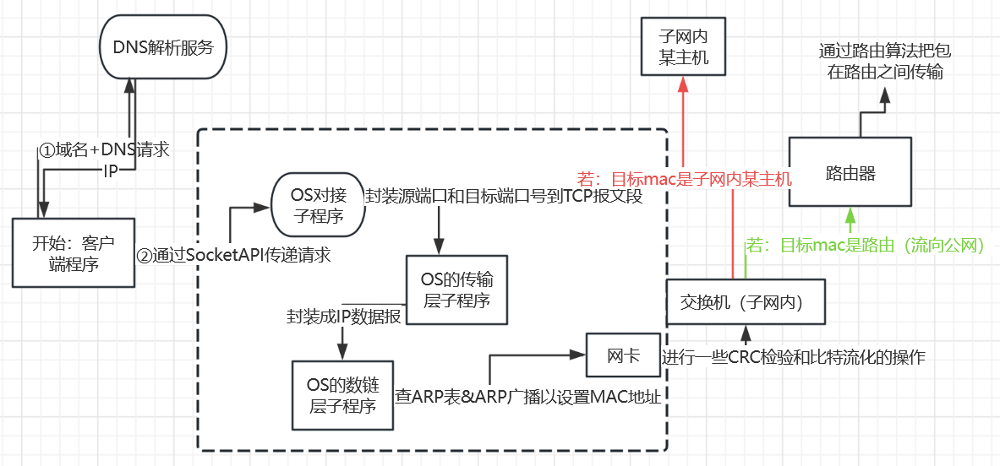

# 计算计网络+通信原理

> 太多的感受融进这万家灯火，笨嘴又拙舌不要责怪我
> 

# 目录

[应用层](计算计网络 dd3c05c7dcae4426975a4ba0a4165b15/%E5%BA%94%E7%94%A8%E5%B1%82%208699f3f178194291b213f0e94f757192.md)

[传输层](计算计网络 dd3c05c7dcae4426975a4ba0a4165b15/%E4%BC%A0%E8%BE%93%E5%B1%82%20261d3e31ce2941ccaed84fe5b7fdc926.md)

[网络层](计算计网络 dd3c05c7dcae4426975a4ba0a4165b15/%E7%BD%91%E7%BB%9C%E5%B1%82%2011705b81548d4c5fad4dbfd21c7fcb8e.md)

[数链层](计算计网络 dd3c05c7dcae4426975a4ba0a4165b15/%E6%95%B0%E9%93%BE%E5%B1%82%2068a932faf57d4e9bb1058be9ab331121.md)

[物理层](计算计网络 dd3c05c7dcae4426975a4ba0a4165b15/%E7%89%A9%E7%90%86%E5%B1%82%202fafc50691f2434d9a85a25a3814a4f4.md)

[互联网的前世今生](计算计网络 dd3c05c7dcae4426975a4ba0a4165b15/%E4%BA%92%E8%81%94%E7%BD%91%E7%9A%84%E5%89%8D%E4%B8%96%E4%BB%8A%E7%94%9F%201040e3fc43764f45a6a718ce0fafb546.md)

[相关基础概念](计算计网络 dd3c05c7dcae4426975a4ba0a4165b15/%E7%9B%B8%E5%85%B3%E5%9F%BA%E7%A1%80%E6%A6%82%E5%BF%B5%20e085edb81e9f494ebd932d3f28b4b5c7.md)

---

---

# 各个层的知识

### 1、各个层的抽象分工

**（1）应用层：**

在软件层面，软件为用户提供网络服务；在软件API接口层面，OS向软件提供访问网络的API接口

**（2）传输层：**

在一个远端到远端连接线路已经确定的情况下，让这个连接健康建立，并保证数据可靠传输和流量控制

传输层提供两种不同的协议：TCP和UDP。TCP协议提供可靠的、面向连接的数据传输服务；而UDP协议则提供无连接的、不可靠的数据传输服务。

**（3）网络层：**

通过路由选择实现确定一条两个远端之间的传输路径，并且用一些相关协议保证数据包在这条连接上可靠地传输，这个传输是无连接的。

**（4）链路层：**

实现在同一网段下的两个端点之间数据的寻路与可靠传输。

**（5）物理层：**

提供了数据在物理媒介上的传输和接收功能。

### 2、一个包具体是怎么传输的

（1）客户端应用程序得到一个域名，通过DNS解析获得一个对应的IP，然后访问一个os提供的Socket API，向OS申请发送HTTP请求，携带参数告诉OS说这个包要发给哪个目标IP和目标端口、请求体、请求头等等。

（2）OS收到请求，会把请求封装成TCP报文段，并封装源端口和目标端口号到TCP报文段头中，并设置一些其他字段。

然后os把TCP报文段传递给它里面的另一个子程序，该子程序再把TCP报文段封装成IP数据报，加入源和目标IP在其中，并设置一些其他字段如TTL（Time-to-Live）字段。

其中，IP协议规定，IP数据报的长度不能超过MTU（Maximum Transmission Unit），所以如果TCP报文段整个转成的单个IP数据报大于MTU，就要对TCP报文段进行切割，变成多个IP数据报。

同时在TCP/IP层的os实现中，还有其他子程序对传输的数据进行监控，以实现重传、流量控制、拥塞控制等机制

（3）然后os再把这些IP数据报传递给它里面的另一个子程序，该子程序查ARP表（如果查不到就做向整个子网做ARP广播，如果源主机和目标主机不在同一个子网，就返回网关（路由器）的mac地址，并把网关的IP设为目标IP）获得该IP地址对应的mac地址，把这些IP数据报切割并封装成帧，加入源和目标mac地址在其中

（4）最后os把这些帧传递给网卡，网卡进行CRC校验以确保数据的完整性，然后把它们加载成比特流并进行一些有利于传输的特殊处理然后发送到网线上进行传输。

（5）包先传给到同个网段的交换机，交换机阅读包中的目标mac地址字段，然后把包转发给同个网段中的目标主机，如果目标主机不在同个网段，就转发给网关（路由器）

（6）路由器通过路由算法，将包通过路由器网络，传输给目标ip对应网段的网关（路由器），然后网关把包给到交换机，交换机把包给到目标主机的网卡…

